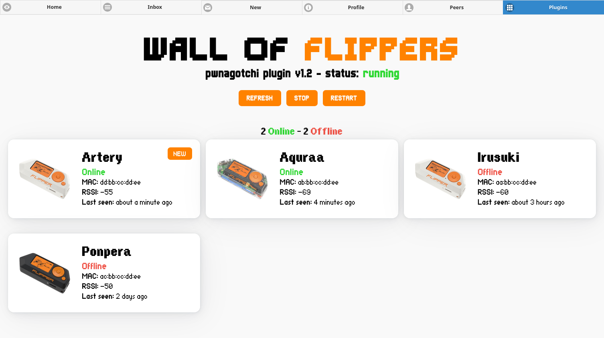

# 🐬 WoF Pwnagotchi plugin


 
 

Simple plugin to show data from Wall Of Flippers on Pwnagotchi's screen. Display total number of Flippers met and the name of the last Flipper that is online. When a new Flipper is met, shows a custom status message with the Flipper's name.

**If Wall of Flippers is not running, it will still display the total number of Flippers met.**

<div align="center">

</div>

## ✅ Prerequisites
Before installing this plugin on your Pwnagotchi, you need to have Wall of Flippers installed. To install it, follow the installation steps on Wall of Flippers Github [repository](https://github.com/K3YOMI/Wall-of-Flippers#-installing-and-requirements-).


> [!TIP]
> If you want to run Wall of Flippers as a systemd daemon (i.e. headless mode), download and use the version from [my repo](https://github.com/cyberartemio/Wall-of-Flippers) (you can follow the PR status on the official branch [here](https://github.com/K3YOMI/Wall-of-Flippers/pull/18)). For the installation process, check out the Pwnagotchi guide inside the `README.md`.

## 🚀 Installation

1. Login inside your pwnagotchi using SSH:
```sh
ssh pi@10.0.0.2
``` 
2. Go to `custom_plugins` directory where all custom plugins of your Pwnagotchi are stored:
```sh
cd /path/to/custom_plugins/directory
```
3. Download the plugin zipped file:
```sh
wget https://github.com/cyberartemio/wof-pwnagotchi-plugin/archive/main.zip
```
4. Extract files and remove useless files:
```sh
unzip main.zip &&
mv wof-pwnagotchi-plugin-main/wof.py . &&
mv wof-pwnagotchi-plugin-main/wof_assets .&&
rm -r wof-pwnagotchi-plugin-main main.zip
```
5. Edit your configuration file (`/etc/pwnagotchi/config.toml`) and add the following:
```toml
# Enable the plugin
main.plugins.wof.enabled = true
# Show the flipper icon on screen instead of the label "[wof]"
main.plugins.wof.icon = true
# Set to true if you have inverted screen colors
main.plugins.wof.icon_reverse = false
# Display coordinates for text position
main.plugins.wof.position.x = 5
main.plugins.wof.position.y = 84
# File system path where Flipper.json file is located
main.plugins.wof.wof_file = "/root/Wall-of-Flippers/Flipper.json"
# A flipper is considered online if its last seen time is within this timespan
main.plugins.wof.online_timespan = 30 # in seconds
```
6. Restart daemon service:
```sh
sudo systemctl restart pwnagotchi
```

Done! Now the plugin is installed and is working.

> [!NOTE]
> If you don't specify any values for `wof.icon`, `wof.icon_reverse`, `wof.position.x`, `wof.position.y`, `wof.wof_file` and `wof.online_timespan`, the plugin will use the following default values:
> - `wof.icon`: `true`
> - `wof.icon_reverse`: `false`
> - `wof.position.x`: `5`
> - `wof.position.y`: `82`
> - `wof.wof_file`: `/root/Wall-of-Flippers/Flipper.json`
> - `wof.online_timespan`: `120` - 2 minutes

## ✨ Web UI

This plugin comes also with a web UI that shows all Flippers met with additional data. You can use it by opening `http://10.0.0.2/plugins/wof` inside your browser (note: you need to be connected to your Pwnagotchi).

Inside the web UI you'll find:

- current status of `wof` systemd daemon
- buttons to start/stop and restart `wof` systemd daemon
- total count of online and offline flippers
- list of all the flippers met with some data
- if you click on a flipper, a modal will pop up with all its data
- auto refresh of data every 60 seconds

Here you can find a preview of what the UI will look like:



## ❤️ Contribution

If you need help or you want to suggest new ideas, you can open an issue [here](https://github.com/cyberartemio/wof-pwnagotchi-plugin/issues/new).

If you want to contribute, you can fork the project and then open a pull request.

## 🥇 Credits

- Wall of Flippers by K3YOMI ([Github](https://github.com/K3YOMI/Wall-of-Flippers))